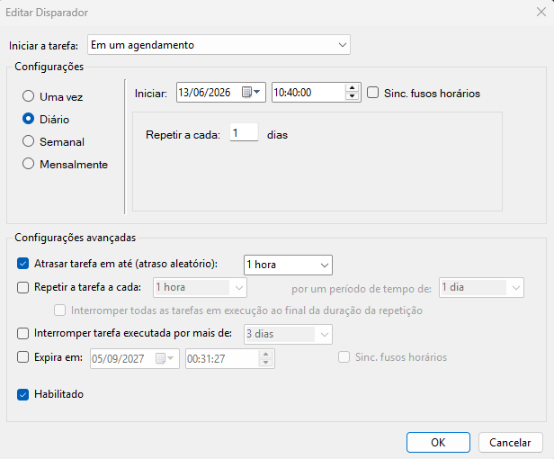

# Auto LinkedIn Bot - Guia de Execução Local (Windows)

Este guia contém o passo a passo para configurar e executar o robô automaticamente no seu próprio computador utilizando o Agendador de Tarefas do Windows. 

Rodar localmente é a forma mais inteligente e segura de executar o bot, pois utiliza o seu IP residencial e um ambiente/navegador que o sistema de segurança do LinkedIn já confia.

## ⚠️ Pré-requisitos
Certifique-se de que o seu arquivo `main.py` está configurado da maneira que você deseja visualizar o bot.
Se quiser que o robô rode de forma totalmente invisível enquanto você usa o PC, certifique-se de manter o modo headless ativado:
```python
browser = p.firefox.launch(headless=True)
```
Se quiser acompanhar o robô abrindo o navegador e trabalhando visualmente na sua tela, mude para `headless=False`.

---

## Passo a Passo de Configuração Inicial

### 1. Preparar o Ambiente Virtual (.venv)
Você já deve ter o ambiente virtual criado na pasta do projeto. Caso precise instalar do zero em um novo computador:
```cmd
python -m venv .venv
.venv\Scripts\activate
pip install -r requirements.txt
playwright install --with-deps firefox
```

### 2. Configurar Variáveis de Ambiente (.env)
Renomeie o arquivo `.env.example` para `.env` na raiz do projeto e insira as suas credenciais de login do LinkedIn:
```env
LINKEDIN_EMAIL=seu_email@exemplo.com
LINKEDIN_PASSWORD=sua_senha
```

### 3. Primeira Execução e Autenticação
> [!IMPORTANT]
Antes de agendar qualquer coisa, é obrigatório rodar o script manualmente pelo menos uma vez para que ele faça o primeiro login e gere o arquivo `sessao.json`. Para isso, configure no topo do `main.py`: **`NAVEGADOR_INVISIVEL = False`**.
Assim que o login for realizado com sucesso, feche o terminal e volte para **`NAVEGADOR_INVISIVEL = True`**.
Dessa forma, as próximas execuções automáticas não precisarão preencher e-mail e senha e rodarão silenciosamente.

```cmd
python main.py
```

### 4. Personalização de Cargos e Limite Seguro de Conexões

#### ⚠️ Limite Diário do LinkedIn (Evite Bloqueios)
O LinkedIn possui algoritmos rigorosos para identificar comportamentos automatizados ou repetitivos:
- **Limite seguro diário:** Recomenda-se enviar **cerca de 20 conexões por dia** (com teto semanal em torno de 100).
- **Risco de bloqueio:** Se você tentar enviar volumes maiores por dia, sua conta poderá sofrer restrições com **bloqueio temporário de 1 semana** para novos convites ou até suspensões mais severas em casos de reincidência.
- O bot já vem configurado para simular o comportamento humano com valores aleatórios (ex: entre 18 e 22 convites diários, ou 8 a 12 divididos por gênero).

#### 🎯 Onde Modificar ou Adicionar Novos Cargos
Para escolher ou adicionar as profissões que o robô deve pesquisar, abra o arquivo [`main.py`](main.py) e localize o dicionário `estrategias` (por volta da **linha 146**):

```python
            estrategias = {
                "engenheiro_dados": [
                    {"keyword": "engenheiro%20de%20dados", "min_conn": 8, "max_conn": 12},
                    {"keyword": "engenheira%20de%20dados", "min_conn": 8, "max_conn": 12}
                ],
                "tech_recruiter": [
                    {"keyword": "tech%20recruiter", "min_conn": 18, "max_conn": 22}
                ],
                # Adicione novas estratégias aqui
            }
```

**Regras para adicionar novos cargos:**
1. **Espaços na palavra-chave:** No campo `keyword`, substitua todos os espaços por `%20` (ex: `"cientista%20de%20dados"`).
2. **Soma diária de conexões:** 
   - Para buscas únicas, defina `min_conn: 18` e `max_conn: 22`.
   - Se for dividir a busca (ex: termos masculino e feminino), configure `min_conn: 8` e `max_conn: 12` em cada um, garantindo que o total diário permaneça próximo de **20 conexões**.

---

## Como Automatizar Execuções Diárias no Windows

Nós criamos um arquivo chamado `run_bot.bat` que é o responsável por iniciar o seu ambiente virtual e dar a partida no código em Python.
Lembre-se de editar o .bat e colocar o endereço do projeto!
Para que o Windows chame esse arquivo todos os dias no mesmo horário de forma religiosa, siga estes passos no **Agendador de Tarefas**:

1. Aperte a tecla **Windows** no teclado, digite **Agendador de Tarefas** (ou *Task Scheduler*) e aperte `Enter`.
2. No menu "Ações" localizado à direita, clique em **"Criar Tarefa Básica..."**
3. **Na aba "Geral"**, digite `Robô LinkedIn` (ou o nome que preferir) e clique em Avançar.
4. **Na aba Disparadores:** crie um novo disparador e siga o exemplo da imagem abaixo:

5. **Na aba Ações:** escolha "Iniciar um programa" e avance.
Em Programa/Script: Clique no botão **"Procurar..."**, navegue até a pasta do seu projeto (`C:\Users\artur\Documents\auto_linkedin\`) e selecione o executável **`run_bot.bat`**. Avance e depois clique em "OK".

Após isso, pode salvar a tarefa, para testar, clique com o botão direito nela e em seguida em "Executar"

### Observação sobre a Tela de Salvamento (Aba Geral)
Se o Windows pedir alguma senha e der erro na hora de salvar, dê dois cliques na tarefa criada para abrir as Propriedades (Aba Geral) e certifique-se de que a opção **"Executar somente quando o usuário estiver conectado"** está marcada. Isso evita conflitos com contas vinculadas a e-mail Outlook/PIN.